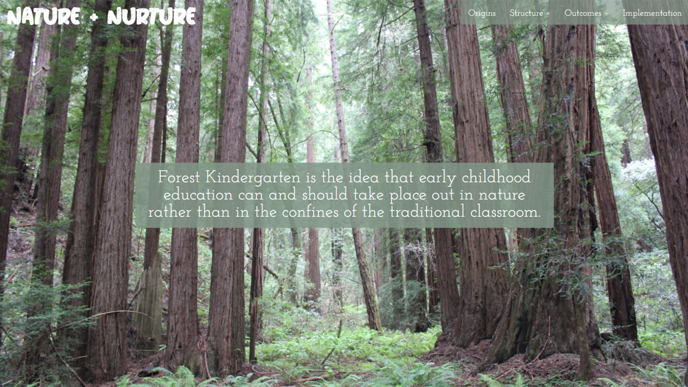

# Nature + Nurture

## An Exploration of Forest Kindergartens and Nature-Based Learning

Outdoor education is not a new concept. It’s been used around the world in various forms for decades and has been increasingly popular in the United States in the form of Forest Kindergartens. Forest Kindergarten is a pedagogy rooted in the idea of free-flow learning, nature immersion, and child-led curriculums. Since the introduction of these programs in the United States, those involved have praised the educational, developmental, and physical benefits, with many academic sources conducting research to back them up. Even still, those just learning about the concept have a variety of questions about its efficacy, many that seem to be driven by a sense of bewilderment that a program so different from the traditional structure could possibly lend the same results. This project aims to show how these programs operate in relation to the traditional kindergarten system and how the current public education structure can begin to think about adopting and benefiting from the concepts applied in the nature-based programs. The project itself is broken down into four sections: Origins, Structure, Outcomes, and Implementation. The end goal is to provide a collection of information about nature-based kindergarten programs to enable audiences in urban, rural, wealthy, and struggling areas to equally learn and benefit from educational developments happening around the country and the world.

